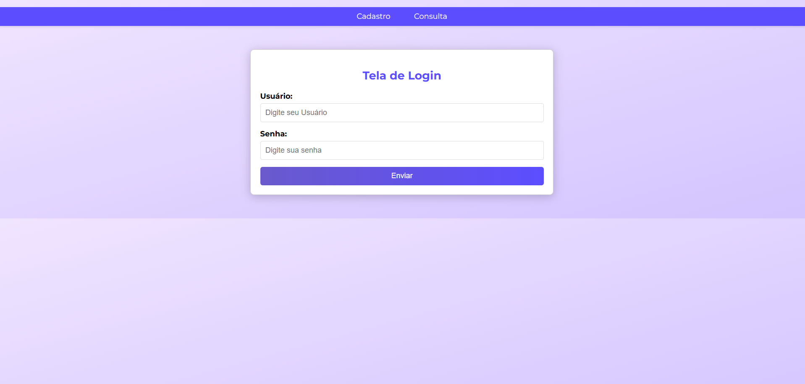
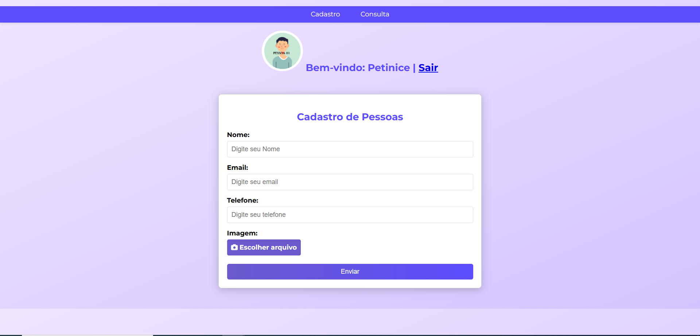
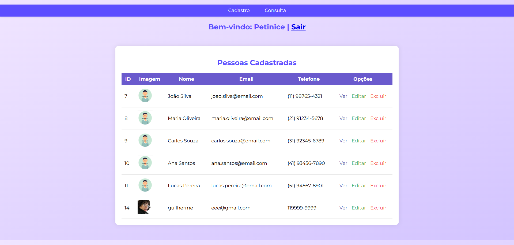

# Web-Service
# 🧑‍💻 Web Service de Cadastro e Consulta de Pessoas

Um sistema simples para **cadastrar pessoas** e **consultar registros** em um banco de dados **SQLite3**, com interface construída em **HTML, CSS e JavaScript**.  
O objetivo é fornecer um CRUD básico para prática de programação web com integração de banco de dados.

---

## 🚀 Funcionalidades

- 📌 Cadastro de novas pessoas (nome, e-mail, telefone e foto de perfil)
- 🔍 Consulta de pessoas já cadastradas
- ✏️ Edição de registros existentes
- ❌ Exclusão de registros
- 💾 Persistência de dados usando **SQLite3**
- 🎨 Interface simples e responsiva com HTML + CSS

---

## 🛠️ Tecnologias Utilizadas

- **Frontend:** HTML5, CSS3, JavaScript
- **Backend:** Flask Python + SQLite3
- **Banco de Dados:** SQLite3

---

